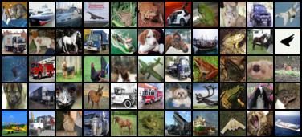
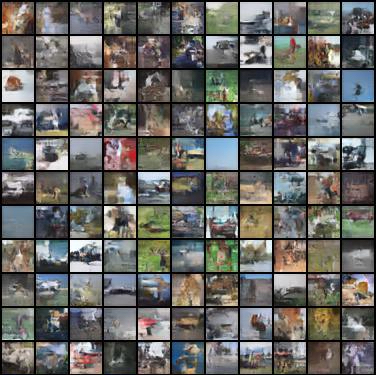

## Invertible Residual Networks

Official Pytorch implementation of i-ResNets.

i-ResNets define a family of fully invertible deep networks, built by constraining the Lipschitz constant of standard residual network blocks.

Reference: Jens Behrmann*, Will Grathwohl*, Ricky T. Q. Chen, David Duvenaud, Jörn-Henrik Jacobsen*. [Invertible Residual Networks](http://proceedings.mlr.press/v97/behrmann19a.html). *International Conference on Machine Learning (ICML), 2019. (https://icml.cc/)*
(* equal contribution)


## i-ResNet Usage

Tested with: Python 3.6.5 and Pytorch 1.0.1

Dependencies can be installed via `pip install -r requirements.txt`

Note: You need to run visdom server and set vis_server location as well as port.

Train i-ResNet classifier on CIFAR10:
```
$ bash scripts/classify_cifar.sh
```
Train i-ResNet density model on CIFAR10 (Batch size and learning rate optimized for 4GPUs):
```
$ bash scripts/dens_est_cifar.sh
```


## CIFAR10 Results

Real data:


Reconstructions:



Samples from trained density model:



## If you use our code please cite

```bibtex
@InProceedings{pmlr-v97-behrmann19a,
  title = 	 {Invertible Residual Networks},
  author = 	 {Behrmann, Jens and Grathwohl, Will and Chen, Ricky T. Q. and Duvenaud, David and Jacobsen, Joern-Henrik},
  booktitle = 	 {Proceedings of the 36th International Conference on Machine Learning},
  pages = 	 {573--582},
  year = 	 {2019},
  editor = 	 {Chaudhuri, Kamalika and Salakhutdinov, Ruslan},
  volume = 	 {97},
  series = 	 {Proceedings of Machine Learning Research},
  address = 	 {Long Beach, California, USA},
  month = 	 {09--15 Jun},
  publisher = 	 {PMLR},
  pdf = 	 {http://proceedings.mlr.press/v97/behrmann19a/behrmann19a.pdf},
  url = 	 {http://proceedings.mlr.press/v97/behrmann19a.html},
  abstract = 	 {We show that standard ResNet architectures can be made invertible, allowing the same model to be used for classification, density estimation, and generation. Typically, enforcing invertibility requires partitioning dimensions or restricting network architectures. In contrast, our approach only requires adding a simple normalization step during training, already available in standard frameworks. Invertible ResNets define a generative model which can be trained by maximum likelihood on unlabeled data. To compute likelihoods, we introduce a tractable approximation to the Jacobian log-determinant of a residual block. Our empirical evaluation shows that invertible ResNets perform competitively with both state-of-the-art image classifiers and flow-based generative models, something that has not been previously achieved with a single architecture.}
}
```
